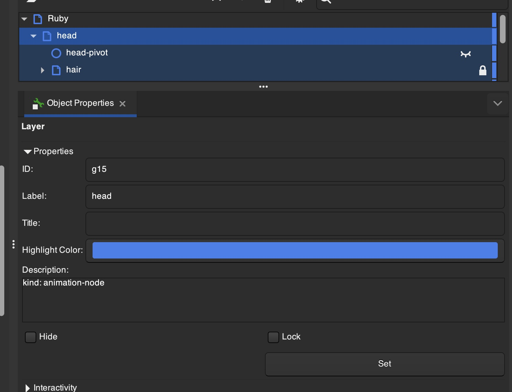
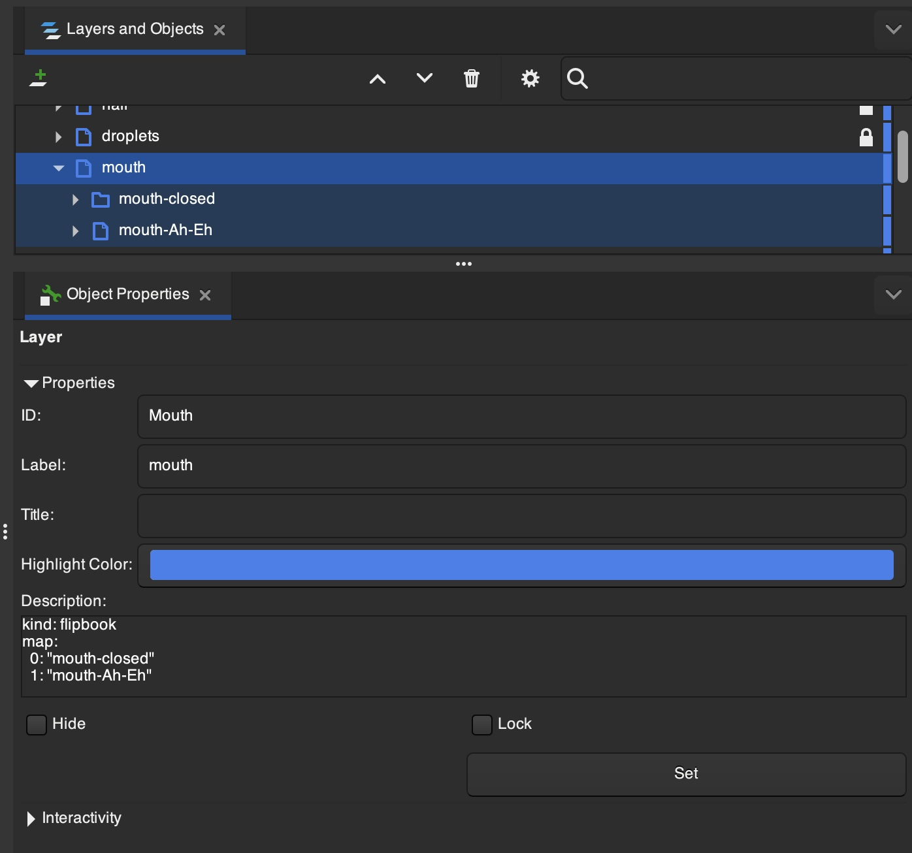
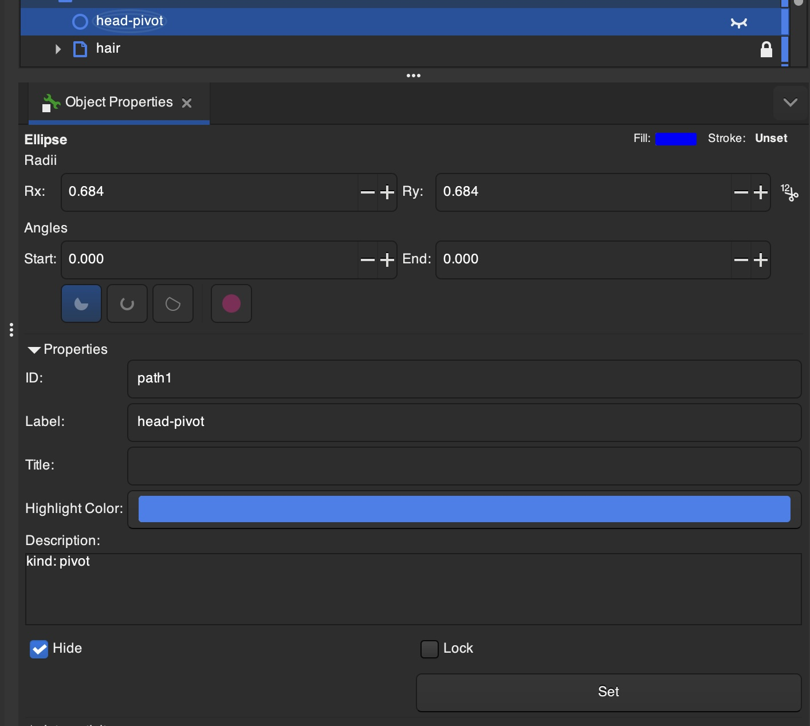
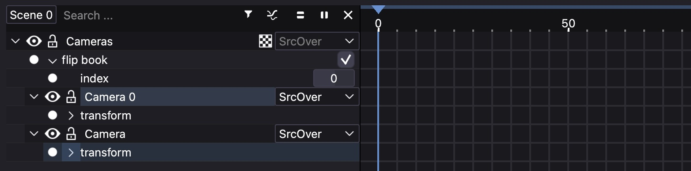

# earlye/friction Fork Changes

This document tracks changes landed in [earlye/friction](https://github.com/earlye/friction) relative to upstream [friction2d/friction](https://github.com/friction2d/friction).

## New Features

### SVG-Driven Animation System (SvgElementTrack)

A new animation targeting system that reads YAML annotations from SVG
`<desc>` elements and automatically creates animation tracks bound to
SVG elements by `id` or `inkscape:label`.

This is the biggest feature here, and the one that motivated this
fork. The intent is to change friction from "everything in this file"
to "this file is the puppeteer controlling a bunch of other SVGs. If
you improve those SVGs, just re-render here."

The mechanism that allows this is a new annotation system that you can
inject into SVG documents. It features YAML in SVG `<desc>`
elements. Each embedded YAML document represents a discriminated union
of the form below, where "other-attributes" are dependent on the `kind`.

```yaml
kind: "kind-identifier"
# ... other-attributes here
```

Here are the `kind`s introduced so far:

- `animation-node` There are no additional attributes yet
  (inverse-kinematics is being contemplated). This tells friction to
  include an SvgElementTrack in the timeline that controls the
  enclosing svg element.
  

  SvgElementTrack explicitly leaves out a `pivot` track - use the
  `pivot` `<desc>` annotation instead.

  Example Syntax:
  ```yaml
  kind: animation-node
  ```

- `flipbook` Sets up the enclosed svg element as a flipbook in
  friction. The `map` yaml attribute tells friction which other
  elements to display/hide when the flipbook index changes in
  friction.

  

  Additional attributes:

    - `map` maps index to locator-for-page. locator is svg id
      attribute, with fallback to svg inkscape:label attribute.

  Example Syntax:
  ```yaml
  kind: flipbook
  map:
    0: "mouth:closed"
    1: "mouth:opened"
  ```


- `pivot` Tells friction that the enclosing `<circle>`'s center is the
  rotation point for the nearest ancestor annotated with `kind:
  animation-node`

  

  Example Syntax:
  ```svg
  <g id='a'>
    <desc>kind: animation-node</desc>
    <circle cx="32" cy="45"><desc>kind: pivot</desc></circle>
    ...other-stuff...
  </g>
  ```

  In this example, `32,45` become the pivot coordinates for group `a`.

  Example Syntax:
  ```yaml
  kind: pivot
  ```

- `animation-follower` Makes the enclosing element automatically mirror
  the transform of a named controller element at every frame — both
  during timeline playback and when the user drags the controller
  directly on the canvas.

  Additional attributes:

    - `controller` the `id` or `inkscape:label` of the element whose
      transform this element should follow.

  Example Syntax:
  ```yaml
  kind: animation-follower
  controller: "my-controller-element"
  ```

#### History

- [#4](https://github.com/earlye/friction/pull/4): per-element
  animation targeting for SvgLinkBox
- [#8](https://github.com/earlye/friction/pull/8),
  [#9](https://github.com/earlye/friction/pull/9): SvgElementTrack
  (animation track support)
- [#13](https://github.com/earlye/friction/pull/13): `<desc>` YAML
  auto-creates SvgElementTracks on import
- [#14](https://github.com/earlye/friction/pull/14): flipbook track
  support for SvgLinkBox
- [#23](https://github.com/earlye/friction/pull/23): `kind:pivot` SVG
  desc tag
- [#65](https://github.com/earlye/friction/pull/65): `kind:animation-follower`
  mirrors named controller element transforms

### Camera as a first class entity

Added an "add camera" button, and implemented support for having a
camera as a first class entity that can be translated within the
scene. If there is a camera, it is wrapped by a Cameras flipbook, so
that specific cameras can be selected, and switched by an animation
track. (No transition effects for now - just hard cuts). Pressing 'C'
toggles between "look through camera" and "look at world."



#### History

- [#29](https://github.com/earlye/friction/pull/29): `CameraBox`,
  `cameraCreate` canvas mode, and multi-camera flipbook selection

### Lock Entity UX

Upstream friction has a lock feature to protect elements from
accidental edits, but enforcement was inconsistent — children of a
locked parent could still be modified by dragging sliders or typing
values directly, and timeline keyframe operations ignored lock state
entirely. This fork hardens locking so it is fully enforced:

- Dragging a slider or typing a value directly on any child of a
  locked entity is blocked
- Keyframe deletion and timeline moves respect the lock state of the
  affected object
- When any modification is blocked by a lock, the lock icon flashes to
  give immediate visual feedback explaining why the operation was
  rejected

#### History

- [#35](https://github.com/earlye/friction/pull/35): flash lock icon
  on blocked modification
- [#36](https://github.com/earlye/friction/pull/36),
  [#37](https://github.com/earlye/friction/pull/37): block slider drag
  and manual typing on children of locked entities
- [#47](https://github.com/earlye/friction/pull/47): keyframe deletion
  and movement respect lock state

### Keyboard Shortcuts

Remapped frame-level editing operations to match common animation tool
conventions.

#### History

- [#39](https://github.com/earlye/friction/pull/39): Add Keyframe →
  `K`; Split Clip → `Shift+K` across all platforms

### Categorized Debug Logging

Replaced `qDebug()` throughout the codebase with categorized
`qCDebug` logging, enabling per-subsystem filtering via
`QT_LOGGING_RULES`. Previously, debug output was either all-on or
all-off.

#### History

- [#16](https://github.com/earlye/friction/pull/16): replace
  `qDebug()` with `qCDebug` categories throughout codebase

### SemVer 2.0 Build Versioning

Switched to SemVer 2.0 build metadata (`X.Y.Z+build.N`) to give every
CI artifact a unique, sortable version string.

#### History

- [#21](https://github.com/earlye/friction/pull/21): structured build
  metadata using SemVer 2.0

### CI / Release Automation

Added macOS and Linux CI workflows and a release pipeline that builds
all platform artifacts and publishes a GitHub release automatically on
every merge to `main`.

#### History

- [#1](https://github.com/earlye/friction/pull/1): macOS CI — SDK
  caching, concurrency, named artifacts
- [#22](https://github.com/earlye/friction/pull/22): release workflow
  — builds all platforms and creates a GitHub release on merge
- [#33](https://github.com/earlye/friction/pull/33): parallel macOS CI
  — arm64 and x86_64 as separate jobs

### Audio Waveform in Animation Timeline

The timeline now renders the decoded audio waveform behind clip
regions, giving visual tempo cues for keyframe placement.

#### History

- [#56](https://github.com/earlye/friction/pull/56): audio waveform
  visualization in animation timeline

### Developer Tooling

A `Justfile` was added to make macOS builds and debug sessions usable
without manual CMake invocations (`just build-debug`, `just
build-mac-arm`), along with tooling for symbol indexing and Claude
Code worktree sessions.

#### History

- [#2](https://github.com/earlye/friction/pull/2),
  [#7](https://github.com/earlye/friction/pull/7): Justfile with
  `just build-debug` and `just build-mac-arm` recipes
- [#40](https://github.com/earlye/friction/pull/40): `just
  run-debug-with-logs` — config-driven debug sessions with log category
  filtering
- [#44](https://github.com/earlye/friction/pull/44): `just index` —
  ctags symbol index for IDE/AI navigation
- [#49](https://github.com/earlye/friction/pull/49): `just index`
  includes CodeGraph init
- [#50](https://github.com/earlye/friction/pull/50): `just
  start-worktree` — named tmux window for Claude Code worktree sessions

## Known Issues

Playback on windows appears to drop the frame cache, resulting in
audio with a black display. Currently being worked in
[#52](https://github.com/earlye/friction/pull/52)

## Bug Fixes

Bug entries are annotated with their likely origin:
**[fork-introduced]** means the bug was brought in by this fork's own
changes; **[pre-existing]** means the bug was present in upstream code
before the fork.

### CI / Build

| # | Fix | Origin |
|---|-----|--------|
| [#3](https://github.com/earlye/friction/pull/3) | Fix macOS CI not running on `main` branch pushes | fork-introduced — CI workflow was added by this fork |
| [#6](https://github.com/earlye/friction/pull/6) | Fix Linux CI for push events and branch names containing `+` | fork-introduced — Linux CI workflow was added by this fork |
| [#12](https://github.com/earlye/friction/pull/12) | Restrict CI push triggers to `main`; eliminate duplicate PR builds | fork-introduced — trigger logic was set up by this fork |
| [#26](https://github.com/earlye/friction/pull/26) | Fix reusable workflow concurrency groups cancelling release builds | fork-introduced — release workflow was added by this fork |
| [#27](https://github.com/earlye/friction/pull/27) | Fix Linux/macOS sharing same concurrency group within a release run | fork-introduced — same |
| [#28](https://github.com/earlye/friction/pull/28) | Fix release artifact glob: Linux artifact has a version subdirectory | fork-introduced — same |
| [#42](https://github.com/earlye/friction/pull/42) | Fix shallow checkout causing wrong commit count in build version | fork-introduced — SemVer CI setup introduced the shallow-clone assumption |
| [#43](https://github.com/earlye/friction/pull/43) | Optimize CI: SDK/Docker caching, `MKJOBS=4`, DMG arch naming, 7z `-mx5` | fork-introduced — CI infrastructure owned by this fork |

### Rendering / Playback

| # | Fix | Origin |
|---|-----|--------|
| [#15](https://github.com/earlye/friction/pull/15) | Fix render output hang: suppress `mStateId++` during output rendering | likely fork-introduced — render pipeline was modified by SvgElementTrack work |
| [#19](https://github.com/earlye/friction/pull/19) | Fix preview black screen: suppress `mStateId++` during preview rendering | likely fork-introduced — same render pipeline changes |
| [#18](https://github.com/earlye/friction/pull/18) | Fix crash in VideoEncoder: `sws` context dimension mismatch and image use-after-free | pre-existing — bug was in the existing upstream VideoEncoder code |
| [#53](https://github.com/earlye/friction/pull/53) | Fix re-render doing nothing after first render completes | likely fork-introduced — render state management changed by animation work |

### Camera / Viewport

| # | Fix | Origin |
|---|-----|--------|
| [#31](https://github.com/earlye/friction/pull/31) | Fix camera box drawn at wrong position when camera is active viewport | fork-introduced - this is a fork feature |
| [#38](https://github.com/earlye/friction/pull/38) | Fix C-toggle clip state ignored when camera is active | fork-introduced |
| [#41](https://github.com/earlye/friction/pull/41) | Fix active camera box hover/selection in canvas viewport | fork-introduced |
| [#46](https://github.com/earlye/friction/pull/46) | Fix double camera transform on SvgElementTrack elements after timeline scrub | fork-introduced |

### SvgElementTrack / Flipbook

| # | Fix | Origin |
|---|-----|--------|
| [#20](https://github.com/earlye/friction/pull/20) | Fix FlipBook `<desc>` index: use step-function instead of interpolation | fork-introduced — flipbook track is a fork feature |
| [#24](https://github.com/earlye/friction/pull/24) | Fix `kind:pivot` not taking effect due to deferred center-pivot overwrite | fork-introduced — `kind:pivot` is a fork feature |
| [#30](https://github.com/earlye/friction/pull/30) | Fix SvgElementTrack `syncToTarget` accumulating stale keyframes | fork-introduced — SvgElementTrack is a fork feature |
| [#32](https://github.com/earlye/friction/pull/32) | Fix SvgElementTrack including transform effects in animation track tree | fork-introduced — same |
| [#48](https://github.com/earlye/friction/pull/48) | Fix flipbook index field not triggering canvas redraw on edit | fork-introduced — same |
| [#55](https://github.com/earlye/friction/pull/55) | Fix flipbook page lookup ignoring `inkscape:label` when `id` is absent | fork-introduced — same |
| [#67](https://github.com/earlye/friction/pull/67) | Fix flipbook track names preferring `id` over `inkscape:label` | fork-introduced — same |

### Lock System

| # | Fix | Origin |
|---|-----|--------|
| [#36](https://github.com/earlye/friction/pull/36), [#37](https://github.com/earlye/friction/pull/37) | Fix locked entity children allowing slider drag and manual typing | fork-introduced — enhanced locking UX is a fork feature |
| [#47](https://github.com/earlye/friction/pull/47) | Fix keyframe deletion and movement ignoring object lock state | fork-introduced — same |

### SVG Import

| # | Fix | Origin |
|---|-----|--------|
| [#66](https://github.com/earlye/friction/pull/66) | Fix SVG stroke-width import: style-parsed widths were reset when the direct attribute was absent; element transform scale was double-applied (once at import, once at render) | pre-existing — bugs were in upstream `BoxSvgAttributes::loadBoundingBoxAttributes` |

### Compiler Warnings

| # | Fix | Origin |
|---|-----|--------|
| [#11](https://github.com/earlye/friction/pull/11) | Fix `-Winconsistent-missing-override` warning in SvgLinkBox | pre-existing — warning was in existing upstream SvgLinkBox |
| [#17](https://github.com/earlye/friction/pull/17) | Fix `-Wunused-but-set-variable` warnings across codebase | pre-existing — warnings were in existing upstream code |

### Developer Tooling

| # | Fix | Origin |
|---|-----|--------|
| [#45](https://github.com/earlye/friction/pull/45) | Fix `just index` to use Homebrew `universal-ctags` on macOS | fork-introduced — `just index` recipe is a fork addition |
| [#51](https://github.com/earlye/friction/pull/51) | Set tmux window name in `start-worktree` recipe | fork-introduced — recipe is a fork addition |
| [#54](https://github.com/earlye/friction/pull/54) | Fix `just index` recipe handling stale CodeGraph state | fork-introduced — same |
| [c18c4e6](https://github.com/earlye/friction/commit/c18c4e640) | Fix Justfile | fork-introduced — Justfile is a fork addition |
